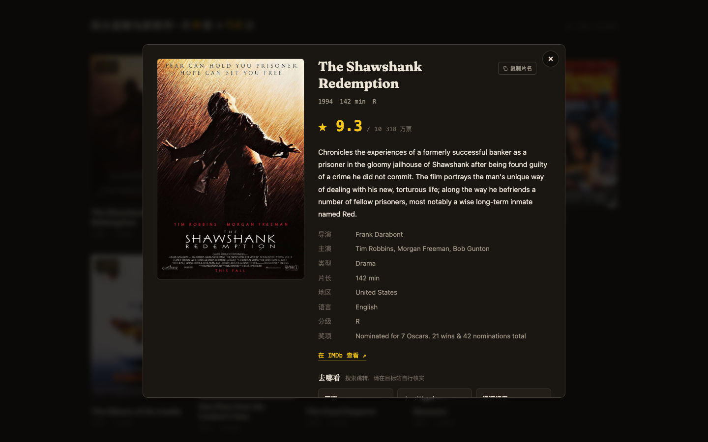

# 今晚看什么 · Tonight Movie

**中文** | [English](#english)


> 说一句人话（比如"我想看一部高分悬疑片"），AI 理解你的观影需求，从 OMDb 检索并筛出 IMDb 高分电影，海报墙一目了然。
> Describe what you want to watch in plain language. AI parses your intent, queries OMDb, and filters down to high-rated IMDb movies on a poster wall.

[Live Demo](https://imdb.qiaomu.ai) · [Deploy with Vercel](https://vercel.com/new/clone?repository-url=https://github.com/joeseesun/tonight-movie&env=OMDB_API_KEY,DEEPSEEK_API_KEY&envDescription=OMDb%20%E5%92%8C%20DeepSeek%20%E7%9A%84%20API%20Key&project-name=tonight-movie) · 

**已验证:** 线上 https://imdb.qiaomu.ai 运行中 · 端到端检索 5-10 秒 · 桌面 / 移动端截图验收通过

## 这是什么

一个零后端的电影推荐小站（纯静态前端 + 两个 Vercel Serverless 函数）。你用人话描述想看的片子，它给你一面经过 IMDb 评分筛选的海报墙，点卡片看详情、复制片名、跳转豆瓣 / JustWatch / 资源搜索。

和"豆瓣 Top 250"类清单的区别：片单不是写死的，是按你这句话实时理解、实时检索、实时筛出来的。

## 核心能力

| 能力 | 用户得到什么 |
|---|---|
| 自然语言找片 | "90 年代的高分科幻片""诺兰导演的烧脑电影""来一部 9 分以上的神作"都能懂 |
| AI 意图解析 | DeepSeek 提取题材、年代、评分门槛，生成英文检索计划 |
| IMDb 评分筛选 | "高分"≥ 7.5，"神作"≥ 8.0，候选不足自动放宽并明示 |
| 海报墙结果 | 海报、评分徽章、片名、年份、类型，交错浮现动效 |
| 详情弹窗 | 完整简介、导演、主演、片长、地区、奖项、IMDb 链接 |
| 片名一键复制 | 卡片和弹窗都能复制英文片名，方便去别处搜索 |
| 去哪看 | 豆瓣 / JustWatch / 资源搜索三个跳转入口（搜索式跳转，不提供资源） |
| 海报代理 | 海报经服务端代理转发，解决部分地区 Amazon 图床不可达 |



## 快速开始

### 最快路径：Fork 后一键部署

[](https://vercel.com/new/clone?repository-url=https://github.com/joeseesun/tonight-movie&env=OMDB_API_KEY,DEEPSEEK_API_KEY&envDescription=OMDb%20%E5%92%8C%20DeepSeek%20%E7%9A%84%20API%20Key&project-name=tonight-movie)

部署时在 Vercel 界面填入两个环境变量即可：

- `OMDB_API_KEY`（必填）：免费申请 https://www.omdbapi.com/apikey.aspx
- `DEEPSEEK_API_KEY`（推荐）：https://platform.deepseek.com/ ，不配也能跑（退化为直接标题搜索）

### 本地开发

```bash
git clone https://github.com/joeseesun/tonight-movie.git
cd tonight-movie
vercel link        # 关联到你自己的 Vercel 项目
vercel env add OMDB_API_KEY        # 粘贴你的 key
vercel env add DEEPSEEK_API_KEY
vercel dev         # http://localhost:3000
```

前置条件：

- [ ] Node.js 18+（`node --version` 验证）
- [ ] Vercel CLI（`npm i -g vercel`，`vercel --version` 验证）
- [ ] OMDb API Key（每天 1000 次免费请求）
- [ ] DeepSeek API Key（可选，用于意图解析）

## 使用方式

对搜索框说人话就行，例如：

- "我想看一部让人后背发凉的高分悬疑片"
- "90 年代的高分科幻片"
- "适合情侣晚上看的爱情片"
- "轻松点的喜剧，评分别太低"

## 工作原理

```
用户自然语言
  ↓
DeepSeek（意图解析 → 英文片名候选 + 关键词 + 评分/年代条件）
  ↓
OMDb t= 精确查询（候选不足时用 s= 关键词搜索补充）
  ↓
IMDb 评分筛选 + 排序（不足时自动放宽 1 分）
  ↓
海报经 /api/poster 代理回源 Amazon 图床
  ↓
前端渲染海报墙 / 详情弹窗
```

## 项目结构

```
├── index.html          # 单页前端
├── styles.css          # 深色影院风样式（自托管 Fraunces 字体）
├── app.js              # 前端交互（搜索、卡片、弹窗、复制、去哪看）
├── api/
│   ├── recommend.js    # 意图解析 + OMDb 检索 + 评分筛选
│   └── poster.js       # 海报代理（白名单图床 + 长缓存）
├── assets/             # 图标、字体、OG 图
└── docs/assets/        # README 截图
```

## 实测验证

- `POST /api/recommend` "我想看一部高分悬疑片" → 9 部 ≥ 7.5 分电影，约 6 秒
- "来一部 9 分以上的神作" → 准确命中 9.0+ 俱乐部（肖申克 9.3、教父 9.2 …）
- "90 年代的高分科幻片" → 年代过滤生效，结果全部为 1990-1999
- 桌面 1440px / 移动 375px 截图验收，无横向溢出，无失败请求

## 限制与边界

- 本站只做搜索跳转，不提供任何影视资源；跳转目标站内容请自行核实
- OMDb 免费 key 每天 1000 次请求，公共部署建议自行申请并控制访问
- 意图解析质量取决于 DeepSeek 模型表现，过于冷门的描述可能候选不足
- IMDb 评分与豆瓣口味可能有偏差，"高分"以 IMDb 为准

## Troubleshooting

| 问题 | 解决 |
|---|---|
| 部署后搜索报 500 | 检查 Vercel 环境变量 `OMDB_API_KEY` 是否已配置并 Redeploy |
| 结果与意图不符 | 说得更具体：加年代 / 演员 / 导演 / 题材关键词 |
| 海报加载慢 | 首次加载需回源 Amazon 图床，之后走 Vercel 边缘缓存 |
| 不配 DeepSeek 也能跑吗 | 能，但只会用你的原文做标题搜索，效果大打折扣 |

## 关于向阳乔木

- 网站：https://qiaomu.ai · 博客：https://blog.qiaomu.ai · 导航：https://tuijian.qiaomu.ai
- X：[@vista8](https://x.com/vista8) · GitHub：[@joeseesun](https://github.com/joeseesun/)
- 微信公众号：向阳乔木推荐看

## License

[MIT](LICENSE)

---

<a name="english"></a>

# Tonight Movie · English

Describe what you want to watch in plain language ("a mind-bending Nolan movie", "90s sci-fi with high ratings"). DeepSeek parses the intent into an OMDb query plan, the backend verifies candidates against OMDb, filters by IMDb rating, and renders a poster wall. Click a card for full details, one-click title copy, and outbound links to Douban / JustWatch / resource search.

- Live demo: https://imdb.qiaomu.ai
- Stack: static frontend + two Vercel serverless functions (`api/recommend.js`, `api/poster.js`), no build step
- Env vars: `OMDB_API_KEY` (required, free at omdbapi.com), `DEEPSEEK_API_KEY` (recommended; without it the search degrades to raw title search)
- Posters are proxied through `/api/poster` (whitelist-only upstream) so regions where the Amazon image CDN is unreachable still get artwork
- Deploy: use the "Deploy with Vercel" button above, or `vercel dev` locally after `vercel env add`
- Notes: this site only links out to search engines and streaming guides; it does not host or provide any media resources
- License: MIT
